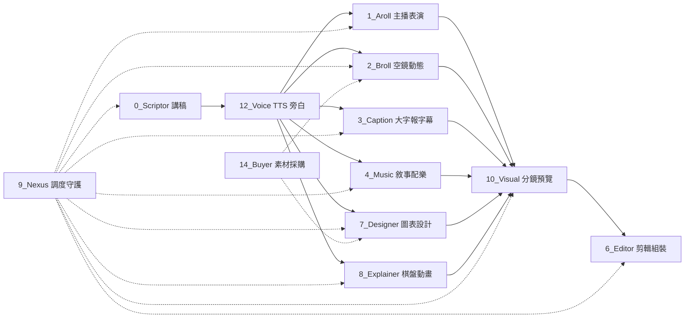

# 🗺️ ROBOT 全系統架構導航地圖 (Master Codebase Map)

> **Token 節約核心準則 (Lean Vibe Coding)**：
> 本專案由多個功能獨立的自動化管道模組構成。進行跨模組開發時，**僅需閱讀本總圖定位目標**；
> 若需深入特定模組細節，直接前往該模組專屬之 `MODULE_MAP.md` 或入口檔案，**嚴禁發動全專案遞迴搜尋**。

---

## 🏗️ 核心管線資料流向 (Pipeline Dataflow)

---

## 🧭 核心模組職責與關鍵入口 (Modules Overview)

| 模組代號 | 模組名稱與職責摘要 | 核心入口腳本與技能 | 詳細模組地圖 |
|---|---|---|:---:|
| **0_Scriptor** | **劇本與講稿生成模組** 長篇解說影片講稿撰寫、語意重構、逐字稿分段、台詞節奏審核與 HTML 提詞機排版。 | • [`0_Scriptor/skills`](file:///C:/dev/Dev_Centaur/0_Scriptor/skills) | — |
| **1_Aroll** | **Live2D 虛擬主播演繹與運鏡模組** 依據逐字稿情感軌跡排定 Live2D 表情、手勢意圖、PixiJS 渲染管線與反應式相機運鏡。 | • [`1_Aroll/run_aroll_pipeline.js`](file:///C:/dev/Dev_Centaur/1_Aroll/run_aroll_pipeline.js) • [`1_Aroll/generate_lipsync.js`](file:///C:/dev/Dev_Centaur/1_Aroll/generate_lipsync.js) • [`1_Aroll/skills`](file:///C:/dev/Dev_Centaur/1_Aroll/skills) | — |
| **2_Broll** | **視覺空鏡與動態影片模組** 靜態 AI 生成圖 Ken Burns 動態運鏡轉影片、Pexels/Pixabay 圖庫搜尋採購與微距螢幕 HUD 特效。 | • [`2_Broll/skills`](file:///C:/dev/Dev_Centaur/2_Broll/skills) | — |
| **3_Caption** | **動態大字報與字幕渲染模組** 自動解析講稿拍點關鍵字，排定動態大字報時間軸並無頭渲染透明 PNG/MOV 字幕軌。 | • [`3_Caption/generate_title_cards_ai.js`](file:///C:/dev/Dev_Centaur/3_Caption/generate_title_cards_ai.js) • [`3_Caption/render_title_cards.js`](file:///C:/dev/Dev_Centaur/3_Caption/render_title_cards.js) • [`3_Caption/subtitle_pipeline.js`](file:///C:/dev/Dev_Centaur/3_Caption/subtitle_pipeline.js) | — |
| **4_Music** | **聲音敘事與配樂導演模組** 建立「敘事狀態 -> 配樂功能 -> 時間軸」架構，以 Silence 為一級公民，排定 BGM/SFX 軌道。 | • [`4_Music/skills`](file:///C:/dev/Dev_Centaur/4_Music/skills) | — |
| **5_Chat** | **社群對話框與動態 UI 模組** 模擬社群動態介面（YouTube 留言區、IG 私訊、推特留言）並無頭錄製為獨立透明影片素材。 | • [`5_Chat/templates/yt_comment.html`](file:///C:/dev/Dev_Centaur/5_Chat/templates/yt_comment.html) • [`5_Chat/skills`](file:///C:/dev/Dev_Centaur/5_Chat/skills) | — |
| **6_Editor** | **剪輯工程與時間軸裝配模組** WhisperX 時間戳精確剪輯、動態規劃 (DP) 語意匹配、多軌視訊與音訊同步與 Premiere 插件支援。 | • [`assemble.js`](file:///C:/dev/Dev_Centaur/assemble.js) • [`6_Editor/skills`](file:///C:/dev/Dev_Centaur/6_Editor/skills) | — |
| **7_Designer** | **視覺設計與動態圖表模組** 高解析參數化 SVG 動態圖表、語意圖表切換狀態精確同步、AI 去背向量化與貼紙邊緣生成。 | • [`7_Designer/skills`](file:///C:/dev/Dev_Centaur/7_Designer/skills) | — |
| **8_Explainer** | **棋盤解說與概念圖解模組** 長篇大論拆解為分鏡關鍵影格藍圖，微秒級棋子位移、光束導向、對話框與物理碰撞稽查。 | • [`8_Explainer/renderer/board_engine.js`](file:///C:/dev/Dev_Centaur/8_Explainer/renderer/board_engine.js) • [`8_Explainer/skills`](file:///C:/dev/Dev_Centaur/8_Explainer/skills) | — |
| **9_Nexus** | **全自動管線指揮總署與審核總監** 半人馬合作準則守護、跨模組 Pipeline 調度執行 (nexus_runner)、母子代理人合規流通與品質把關。 | • [`9_Nexus/nexus_runner.py`](file:///C:/dev/Dev_Centaur/9_Nexus/nexus_runner.py) • [`9_Nexus/clean_project_artifacts.py`](file:///C:/dev/Dev_Centaur/9_Nexus/clean_project_artifacts.py) • [`9_Nexus/skills`](file:///C:/dev/Dev_Centaur/9_Nexus/skills) | — |
| **10_Visual** | **視覺分鏡導演與預覽工作室** 全片視覺 Scene Graph 時間軸編排、多軌即時預覽 Native Studio、即時音訊播放與效果測試。 | • [`10_Visual/python_preview_studio.py`](file:///C:/dev/Dev_Centaur/10_Visual/python_preview_studio.py) • [`10_Visual/build_full_visual_project.py`](file:///C:/dev/Dev_Centaur/10_Visual/build_full_visual_project.py) • [`10_Visual/audio_timeline_engine.py`](file:///C:/dev/Dev_Centaur/10_Visual/audio_timeline_engine.py) | — |
| **12_Voice** | **語音合成與旁白管理模組** TTS 旁白生成（Gemini Native / Edge-TTS / ElevenLabs）、情緒 Prompt 調校與字幕音訊毫秒對齊。 | • [`12_Voice/VoiceStudio`](file:///C:/dev/Dev_Centaur/12_Voice/VoiceStudio) • [`12_Voice/skills`](file:///C:/dev/Dev_Centaur/12_Voice/skills) | — |
| **14_Buyer** | **視覺素材採購與生成調度官** 嚴格 4 階層採購降級梯隊 (免費圖庫 API -> 網路搜尋+轉繪重構 -> Gemini 生圖 -> 人工審批清單)。 | • [`14_Buyer/skills`](file:///C:/dev/Dev_Centaur/14_Buyer/skills) | — |
| **_pipeline_scripts** | **流水線全域共用腳本庫** 多模組共用之 GAN 表情編排、Whisper 重構、API 呼叫與系統相容性測試工具。 | • [`_pipeline_scripts/gan_expression_director.js`](file:///C:/dev/Dev_Centaur/_pipeline_scripts/gan_expression_director.js) • [`_pipeline_scripts/validate_plan.js`](file:///C:/dev/Dev_Centaur/_pipeline_scripts/validate_plan.js) • [`_pipeline_scripts/gas-cli.js`](file:///C:/dev/Dev_Centaur/_pipeline_scripts/gas-cli.js) | — |

---

## ⚡ 常用快捷指令與工具
- **更新全專案索引**：`python tools/indexer/index_engine.py`
- **查詢特定技能**：`python tools/indexer/find_skill.py <關鍵字>`
- **定位程式檔案**：`python tools/indexer/find_code.py <檔名或模組>`
- **查閱完整技能庫**：參閱 [`SKILLS_MAP.md`](file:///{ROOT_DIR.as_posix()}/SKILLS_MAP.md)
